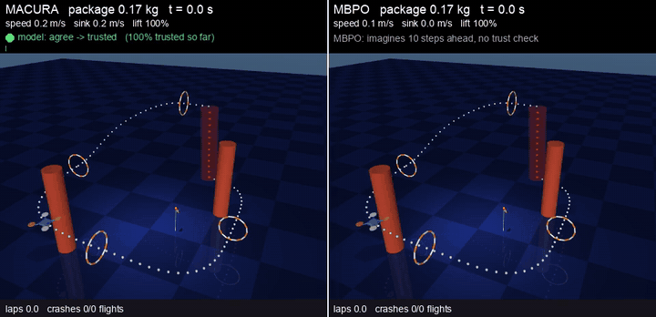
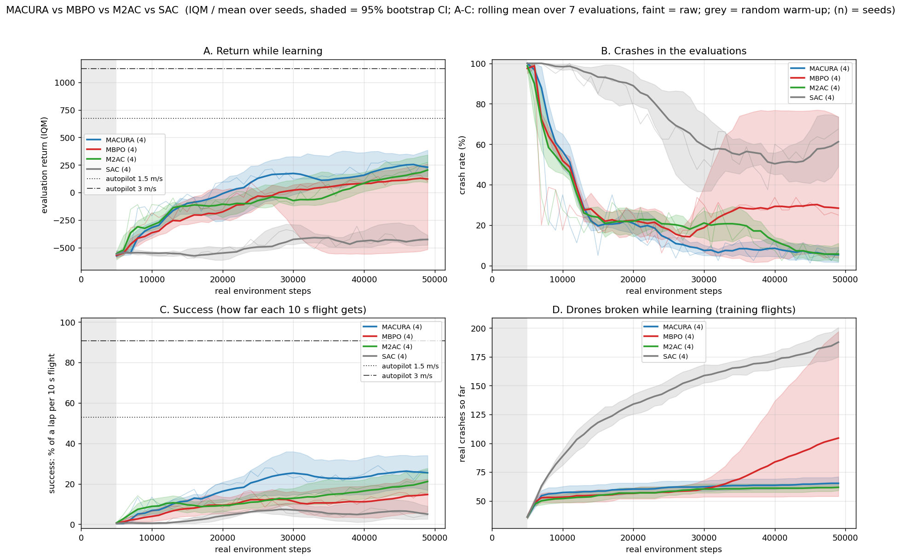
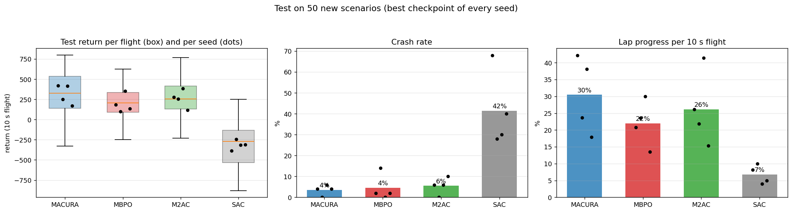
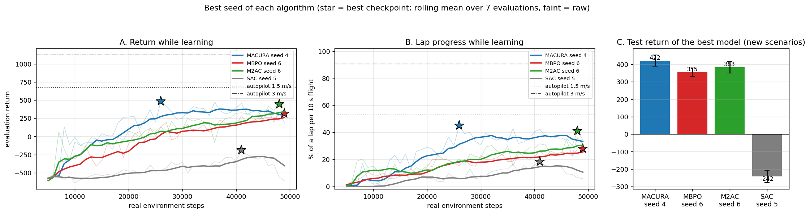
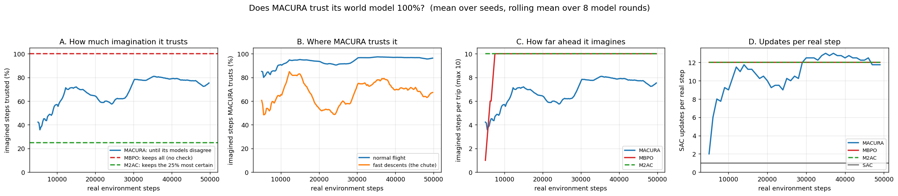
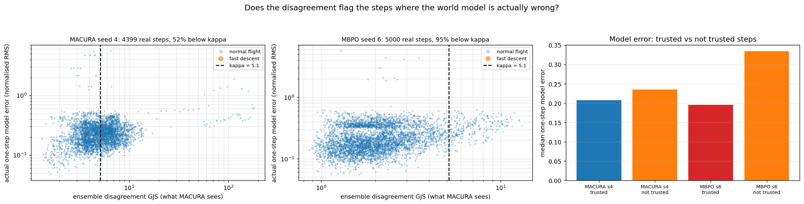
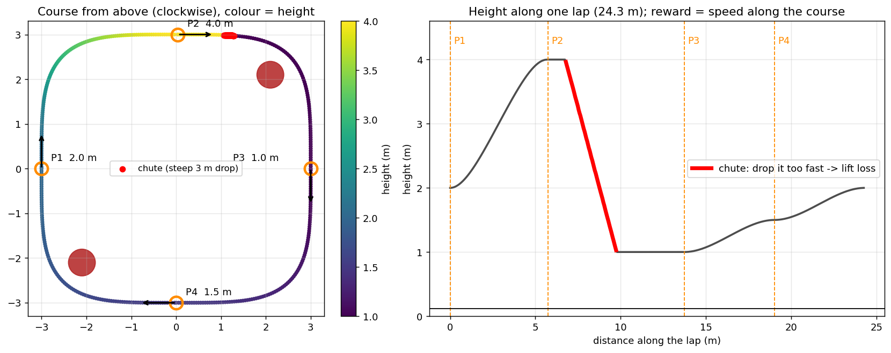
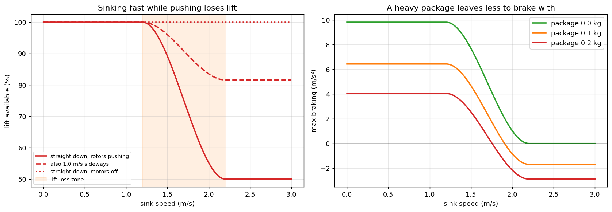
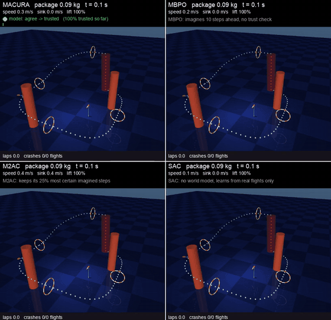

# MACURA races a drone

A drone learns to race laps around a 3-D course, in wind and gusts, carrying a package, with a steep chute where it
can lose lift and crash. Four reinforcement-learning algorithms learn the same task from scratch, with the same
number of real flights, and are compared on new scenarios they have never seen:

| algorithm | what it is |
|---|---|
| **MACURA** | model-based: imagines extra practice with a learned world model, and **stops imagining where its models disagree** |
| **MBPO** | model-based: imagines a fixed number of steps ahead and trusts all of it |
| **M2AC** | model-based: imagines a fixed number of steps and keeps only the 25% it is most sure about |
| **SAC** | model-free: learns only from real flights |

> Paper: *Trust the Model Where It Trusts Itself: Model-Based Actor-Critic with Uncertainty-Aware Rollout
> Adaption*, Frauenknecht et al., ICML 2024 ([`paper/2405.19014v3.pdf`](paper/2405.19014v3.pdf)).
>
> Presentation (the paper, then this project): [`paper/presentation/macura_presentation.pdf`](paper/presentation/macura_presentation.pdf),
> LaTeX source in [`paper/presentation/`](paper/presentation/).



*MACURA (left) and MBPO (right), each the best seed, on a new test scenario. MACURA's panel shows at every step
whether its own world model would trust itself there. Full videos: [`results/videos/`](results/videos/).*

---

## The result

Seeds 4-7, 50,000 real steps each, every model tested on the same **50 new scenarios**
(full tables: [`results/summary.md`](results/summary.md)):

| algorithm | return while learning | drones broken while learning | **test return** | test lap progress | test crash rate |
|---|---|---|---|---|---|
| **MACURA** | **69** | 28 | **333** | **31%** | 4% |
| M2AC | -28 | 26 | 267 | 24% | 6% |
| MBPO | -59 | 28 | 158 | 22% | 2% |
| SAC | -475 | 154 | -312 | 7% | 35% |

IQM (interquartile mean) over the 4 seeds. Lap progress = how much of a full lap (24.3 m) a 10 s flight covers.

- **MACURA beats MBPO in all 4 seeds** on the test (+123 test return on average), and M2AC in 3 of 4 (+57).
- Together with the earlier race3 test (seeds 0-3), **MACURA beats MBPO in 7 of 8 seeds**, both while learning
  (+110 on average) and on the final test flights of training (+105).
- **The comparison is fair**: MBPO and M2AC do 12 training updates per real step; MACURA adapts its own number
  and averaged about 11. It won with slightly less training, not more.
- **SAC fails**: without a world model, 50,000 real steps are far too few.
- **MBPO collapsed once** (seed 5, from +50 to -550): it trusts all of its imagination, also where the model is
  wrong. MACURA had no such collapse in 8 seeds.





The best seed of each algorithm (chosen on the selection scenarios, never on the test), with its best checkpoint
(star) and its test return:



---

## Why MACURA wins: it knows where not to trust its imagination

All three model-based methods learn a **world model**: 7 neural networks that each predict "if the drone is here
and does this, where will it be next, and what reward will it get?". From real states they then **imagine short
trips** (up to 10 steps), 25,000 every 250 real steps, and the SAC learner trains mostly on this imagined data
(95% imagined, 5% real). That is why they need far fewer real flights than SAC.

The difference is how far they trust the imagination:

- **MBPO** always imagines 10 steps, even where the model is wrong, and learns from those mistakes.
- **M2AC** imagines 10 steps and keeps only the 25% of steps where the networks agree most.
- **MACURA** checks at every imagined step how much the 7 networks **disagree** (geometric Jensen-Shannon
  divergence). As soon as the disagreement passes a threshold kappa, it stops that trip. It also adapts how many
  training updates it does to how much imagined data it trusts.

In the chute the drone can lose lift, and the world model is least reliable there. MACURA trusts its model on
about **94% of imagined steps in normal flight, but only about 67% in fast descents**:



Does the disagreement flag the steps where the model is really wrong? Partly: the steps MACURA does not trust have
a higher real model error, but the signal is noisy.



---

## The task (race3)

A quadrotor with an altitude-hold stabiliser flies laps clockwise through four gates, around two pillars, and down
a near-vertical 3 m chute. The policy chooses 4 numbers 50 times per second (sideways acceleration x and y, climb
rate, turn rate) and sees 27 numbers (position, speed, attitude, pillars, package, wind, racing line). The reward
is speed along the course near the racing line; a crash costs 500 and ends the 10 s flight.



What makes it hard for a learned model:
- **hidden gusts and rotor noise** that the drone cannot see,
- a **steady wind** and a **package** of random weight (visible to the drone),
- **lift loss when sinking fast** (from 1.2 m/s, up to 50% of the thrust), the chute trap:



---

## Videos

| video | what it shows |
|---|---|
| [`test_30s.mp4`](results/videos/test_30s.mp4) | MACURA vs MBPO, best seeds, 30 s on a new scenario (the GIF above) |
| [`test_all.mp4`](results/videos/test_all.mp4) | all four best models on three new scenarios |
| [`test_macura_seeds.mp4`](results/videos/test_macura_seeds.mp4) | the four MACURA seeds |
| [`test_mbpo_seeds.mp4`](results/videos/test_mbpo_seeds.mp4), [`test_m2ac_seeds.mp4`](results/videos/test_m2ac_seeds.mp4), [`test_sac_seeds.mp4`](results/videos/test_sac_seeds.mp4) | the four seeds of the others |
| `downloads/<notebook>/runs/videos/` | from training: the best checkpoint of every seed, 30 s |



---

## The study, step by step

```
training/     4 Kaggle notebooks, 2 per account, all running at the same time (about 4-5 h)
                macura_mbpo_seeds45   MACURA + MBPO, seeds 4 5   account nouradon
                m2ac_sac_seeds45      M2AC + SAC,    seeds 4 5   account nouradon
                macura_mbpo_seeds67   MACURA + MBPO, seeds 6 7   account silvergjeka01
                m2ac_sac_seeds67      M2AC + SAC,    seeds 6 7   account silvergjeka01
              each: training with live progress, results, plots, trust, 30 s videos, a recap and <name>.zip
kaggle.sh     start the notebooks, check them, download them (they download the code from GitHub)
downloads/    the 4 downloaded notebooks (plots and videos in git; checkpoints and logs stay local)
testing/      test.ipynb on your computer: all results together, a test of every model on 50 new scenarios,
              test plots and videos, the final comparison and a recap -> results/
results/      summary.md, plots/, videos/
simulate.py   watch the trained drones race live in MuJoCo's 3-D viewer
```

**How to run everything: [`commands_guide.md`](commands_guide.md)** (keys, training on both Kaggle accounts,
download, testing, simulator, GitHub). In short:

```bash
./kaggle.sh push                       # start the 4 training notebooks on Kaggle
./kaggle.sh status                     # until all 4 are COMPLETE
./kaggle.sh get                        # download them into downloads/
jupyter notebook testing/test.ipynb    # Run All -> results/
mjpython simulate.py                   # watch them race
```

---

## Settings (fixed before the runs)

- 50,000 real steps per run: 5,000 random warm-up steps, then 45,000 learning steps.
- MACURA paper protocol: 7-network ensemble (5 elites), 25,000 imagined trips every 250 steps, up to 10 steps each,
  95% imagined / 5% real data per SAC batch, imagined data kept for 4 model rounds.
- MACURA: xi = 0.5, zeta = 0.95, up to 16 updates per real step. MBPO: horizon 1 -> 10. M2AC: paper mode.
- Equal training: MBPO and M2AC do 12 SAC updates per real step (MACURA's average in the pilot).
- Exploration as in the paper: MACURA pink noise, MBPO and M2AC without noise, SAC samples its policy.
- The best checkpoint is chosen on scenarios 100-119, checked on 1000-1029 in training, and tested on new
  scenarios 3000-3049 in `testing/test.ipynb`. Nothing is tuned on test scenarios.

Every setting, every earlier task (cage, delivery, race, race2) and every earlier run: [`docs/EXPERIMENTS.md`](docs/EXPERIMENTS.md).

## Limits

- 8 seeds give a consistent result (7 of 8), but it is only at the edge of statistical significance.
- The trained drones rarely sink fast enough to lose lift in the test: MACURA wins by learning faster and flying
  further, not by surviving the chute better.
- The task is not solved: 31% of a lap per 10 s, against 54% for a simple hand-written autopilot at 1.5 m/s.
- Exploration differs between the methods, as in the paper.

## Code

```
src/config/config.py      every setting
src/envs/                 drone_env.py (the race3 task), race_course.py, autopilot.py, assets/drone.xml
src/models/ensemble.py    the probabilistic ensemble world model
src/algorithms/           sac.py (shared learner), macura.py, mbpo.py, m2ac.py
src/training/             train.py (training loop and evaluation), parallel.py, exploration.py, seed.py
src/analysis/             results.py (scores, tables), testing.py (new-scenario test), report.py
src/viz/                  figures.py, test_figures.py, video.py, simulator.py, scenery.py
```
